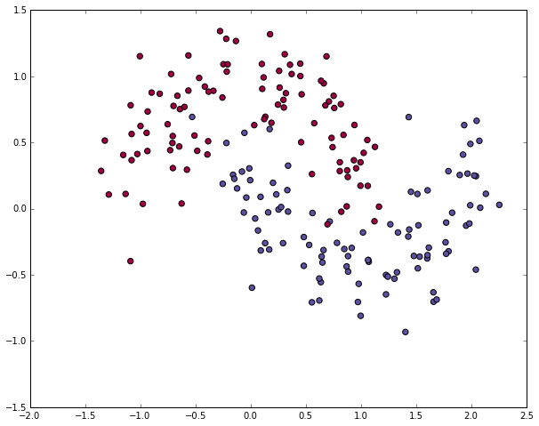
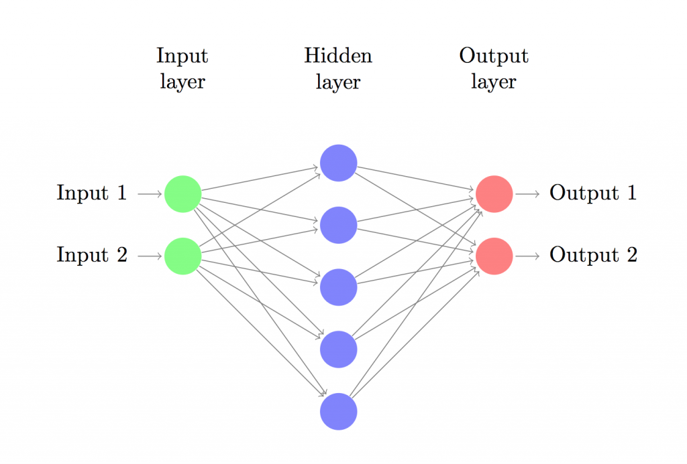
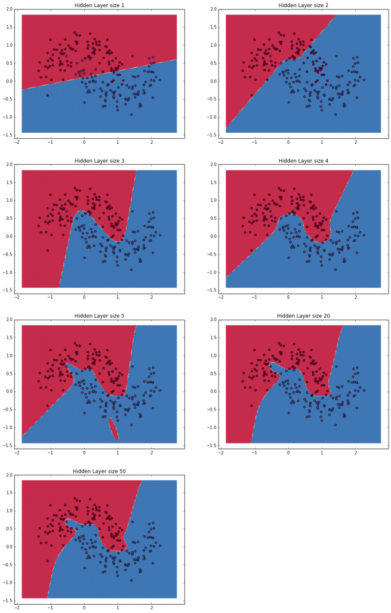

# Create NN from scratch , save it and serve it with Flask
# Requirements
 - Python >=2.7 or >=3.4
 - Flask
# Visualize dataset
$ python visualize.py

The dataset we generated has two classes, plotted as red and blue points.
You can think of the blue dots as male patients and the
red dots as female patients, with the x- and y- axis being medical measurements.

# 3 LAYER NN

# Train and save

$ python model.py

 - After trainig: Your model will be save in static folder

# Running your app
$ python app.py

# Read More
[Implementing a Neural Network from Scratch in Python](http://www.wildml.com/2015/09/implementing-a-neural-network-from-scratch/)
# Thanks
- [Denny Britz](http://www.wildml.com/about/)
